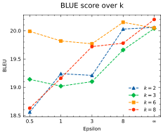
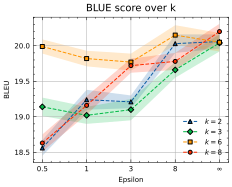
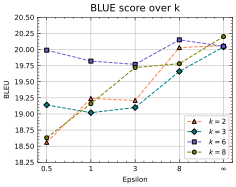
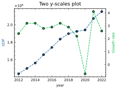
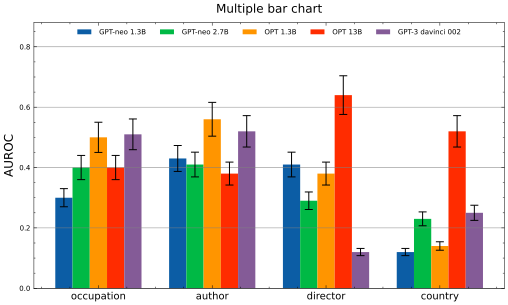
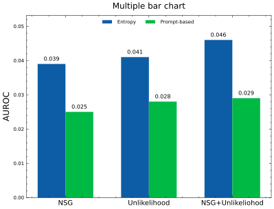
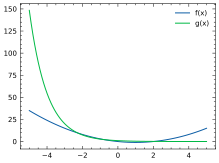
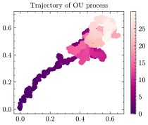

# MonetPlot
<div style="display: flex; align-items: center;">
  
  <div>
  <p style="font-family: 'Georgia', 'Times New Roman', serif; font-size: 18px; font-style: italic;">
  <strong>Transform your csv table into the figure!</strong>
</p>
</p>
  </div>
</div>

<h2 style="margin-top: 30px;">Plot</h2>

`new_data/BLUE_over_k.csv` 
| $\epsilon$ | $k=2$  | $k=3$  | $k=6$  | $k=8$  |
|------------|--------|--------|--------|--------|
| 0.5        | 18.56  | 19.14  | 19.99  | 18.63  |
| 1          | 19.24  | 19.02  | 19.82  | 19.16  |
| 3          | 19.21  | 19.1   | 19.77  | 19.72  |
| 8          | 20.03  | 19.66  | 20.15  | 19.78  |
| $\infty$   | 20.06  | 20.04  | 20.05  | 20.2   |

Since our classes is aligned in the first row. **Set the label_axis="row" (default value)**


```python
monet = MonetPlot("new_data/BLEU_over_k.csv", xaxis=True, CI=False)

monet.plot(xlabel="Epsilon", ylabel="BLEU", marker="enum", linestyle="--", grid=True,    
                title="BLUE score over k", legend=True, markersize=4, titlesize=10, path="figure13.png")
```


    

    


### With confidence interval 
The \<filename\>_CI.csv file should be written without x-axis

`BLEU_over_k_CI.csv` 
| $k=2$ | $k=3$ | $k=6$ | $k=8$ |
|-------|-------|-------|-------|
| 0.11  | 0.13  | 0.10  | 0.12  |
| 0.14  | 0.12  | 0.11  | 0.13  |
| 0.09  | 0.15  | 0.12  | 0.10  |
| 0.13  | 0.11  | 0.14  | 0.12  |
| 0.10  | 0.12  | 0.13  | 0.11  |


```python
monet = MonetPlot("new_data/BLEU_over_k.csv", xaxis=True, CI=True)

monet.plot(xlabel="Epsilon", ylabel="BLEU", marker="enum", linestyle="--", grid=True,    
                title="BLUE score over k", legend=True, markersize=4, titlesize=10, path="figuretemp.png")
```

    <class 'numpy.ndarray'> <class 'numpy.ndarray'> <class 'numpy.ndarray'>


    

    


### Customiztion can be done with `plt.rc_context` 


```python
cycle=[
    "#FF7F50",
    "#008080",
    "#6A5ACD",
    "#808000",
    "#D3D3D3",
]
with plt.rc_context({'axes.prop_cycle': cycler(color=cycle), 'legend.frameon': True}):
    monet = MonetPlot("new_data/BLEU_over_k.csv", xaxis=True, CI=False)
    monet.plot(xlabel="Epsilon", ylabel="BLEU", marker="enum", linestyle="--", ytick_density=.7, grid=True,    
                title="BLUE score over k", legend=True, markersize=4, titlesize=10, path="figure_custom.png")
```


    

    


### Two y-scales

`new_data/gdp.csv`
| 지표          | 2012           | 2013           | 2014           | 2015           | 2016           | 2017           | 2018           | 2019           | 2020           | 2021           | 2022           |
|---------------|----------------|----------------|----------------|----------------|----------------|----------------|----------------|----------------|----------------|----------------|----------------|
| GDP           | "1,440,111.40" | "1,500,819.10" | "1,562,928.90" | "1,658,020.40" | "1,740,779.60" | "1,835,698.20" | "1,898,192.60" | "1,924,498.10" | "1,940,726.20" | "2,071,658.00" | "2,150,575.80" |
| Growth rate   | 2.4            | 3.2            | 3.2            | 2.8            | 2.9            | 3.2            | 2.9            | 2.2            | -0.7           | 4.1            | 2.6            |

Class (지표, GDP)가 first column이기 때문에 label_axis='col'로 세팅 


```python
monet = MonetPlot("new_data/gdp.csv", xaxis=True, CI=False, label_axis='col')
monet.two_yscale_plot(grid=False, xlabel="year", xtick_density=.8, marker="o", linestyle="--", title="Two y-scales plot", titlesize=10, markersize=4, path="figure2.png")
```


    

    


## Histogram

`new_data/gaussian.csv`
| Model1         | Model2          | Model3          |
|----------------|-----------------|-----------------|
| 0.7678186120174201 | 2.661799618670969  | 3.0683708888829253 |
| 1.6825388572926325 | -7.499532213752195 | 1.1561417512750813 |
| 1.2828545690810054 | -0.0020305083966962734 | 0.8526270468480346 |


```python
monetplot = MonetPlot("new_data/gaussian.csv")
monetplot.histogram(density=True, ylabel="Density", title="Histogram", path="histogram")
```


    

    


## Bar Chart 
### Class gap ratio (cgr)과 width ratio (wr)을 조절해서 figure 생성 
Class간의 공백:  $cgr*wr-\frac{wr \cdot \C}{\C+1}$, $\C$는 클래스의 개수  
Bar의 width: $\frac{wr}{\C+1}$ 

`new_data/mbar.csv`
| type       | GPT-neo 1.3B | GPT-neo 2.7B | OPT 1.3B | OPT 13B | GPT-3 davinci 002 |
|------------|--------------|--------------|----------|---------|--------------------|
| occupation | 0.3          | 0.4          | 0.5      | 0.4     | 0.51              |
| author     | 0.43         | 0.41         | 0.56     | 0.38    | 0.52              |
| director   | 0.41         | 0.29         | 0.38     | 0.64    | 0.12              |
| country    | 0.12         | 0.23         | 0.14     | 0.52    | 0.25              |

`new_data/mbar_CI.csv`
| GPT-neo 1.3B | GPT-neo 2.7B | OPT 1.3B | OPT 13B | GPT-3 davinci 002 |
|--------------|--------------|----------|---------|--------------------|
| 0.03         | 0.04         | 0.05     | 0.04    | 0.051             |
| 0.043        | 0.041        | 0.056    | 0.038   | 0.052             |
| 0.041        | 0.029        | 0.038    | 0.064   | 0.012             |
| 0.012        | 0.023        | 0.014    | 0.052   | 0.025             |


```python
moneplot = MonetPlot("new_data/mbar.csv", xaxis=True, CI=True) 
with plt.rc_context({'grid.color' : 'gray'}):
    moneplot.mutiple_bar(grid=True, xlabel="", ylabel="AUROC", cgr=1.1, wr=1.2, ytick_density=.4, show_value=False, 
                    title="Multiple bar chart", titlesize=12, path="barchart.png")
```


    

    


`new_data/halu.csv`

| Method           | Entropy | Prompt-based |
|------------------|---------|--------------|
| NSG              | 0.039   | 0.025        |
| Unlikelihood     | 0.041   | 0.028        |
| NSG+Unlikelihood | 0.046   | 0.029        |


```python
moneplot = MonetPlot("new_data/halu.csv", xaxis=True, CI=False) 
moneplot.mutiple_bar(grid=False, xlabel="", ylabel="AUROC", cgr=1.0, show_value=True, 
                    title="Multiple bar chart", titlesize=12, path="barchart2.png")
                    
```


    

    


## Direct figure with plot 


```python
x = np.linspace(-5,5,100)
y1 = np.power(x,2) - 2*x 
y2 = np.exp(-x)
y = np.array([y1,y2])
labels = np.array(["f(x)", "g(x)"])

moneplot = MonetPlot(xaxis=True, x0=x, yy=y, labels=labels)
moneplot.plot(xlabel="", ylabel="", linestyle= 'solid', legend=True, path="figure13.png")
```


    

    


## Miscellaneous


```python
matrix = np.random.standard_normal(size=(12,12))
MonetPlot.display_array(matrix, cmap="viridis")
```


    

    


```python
from ou_noise import ou 
t = np.arange(0, 30, 0.01)
x = ou.path(0.0, t, .4, 0.5, 0.05)
y = ou.path(0.0, t, .4, 0.5, 0.05)
MonetPlot.scatter(x,y,timestamp=t, title="Trajectory of OU process")
```


    

    
